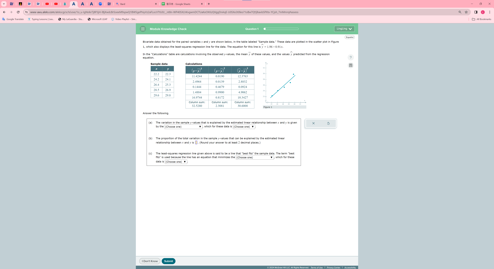
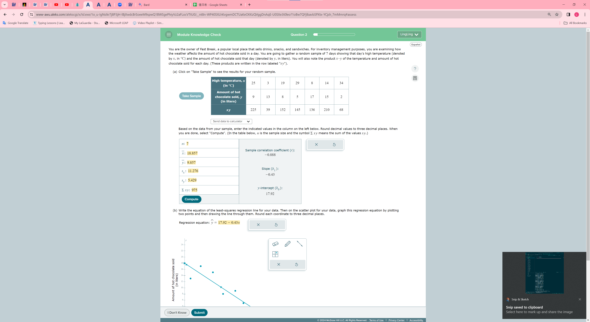
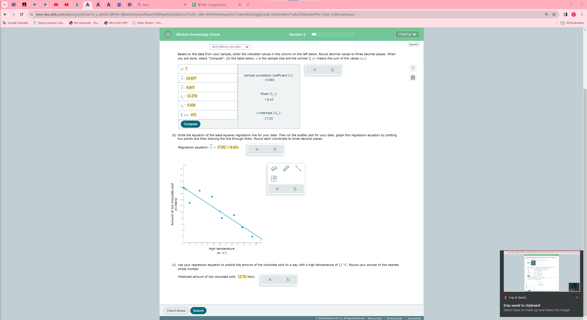
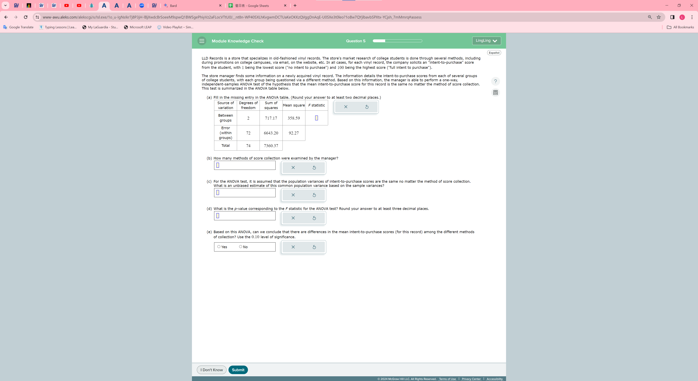
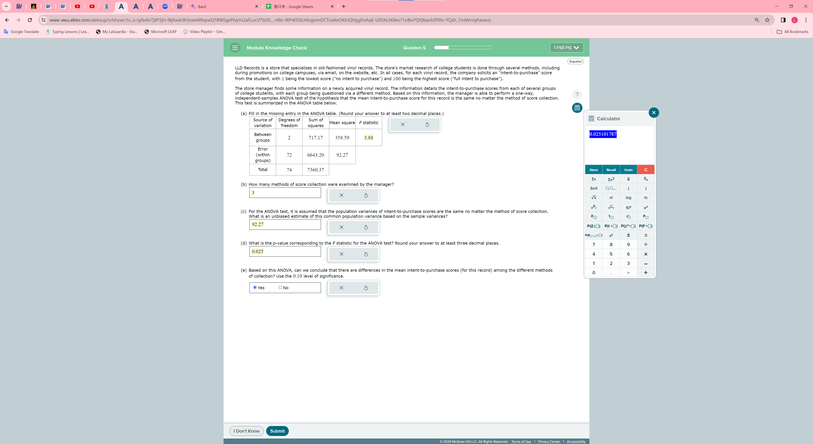
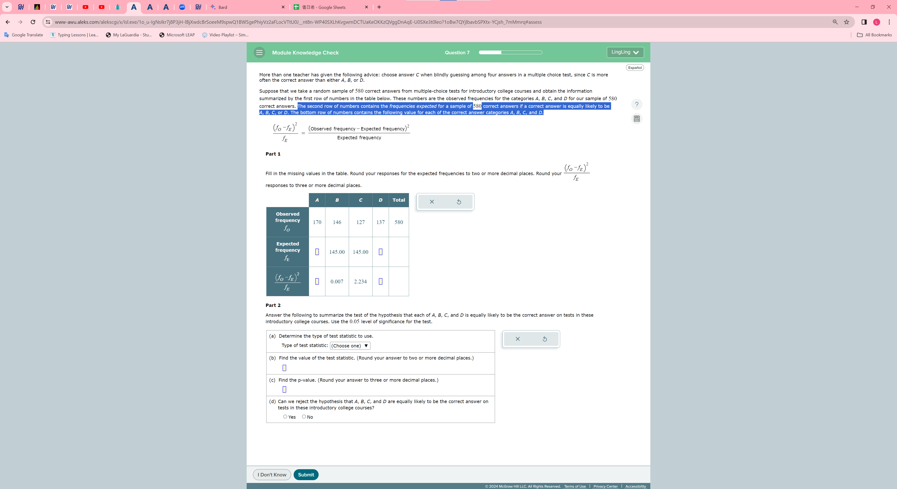

#1

#2

#3
#4
#5

(a) To fill in the missing entry for the F statistic in the ANOVA table, we use the formula for the F statistic in ANOVA, which is the ratio of the mean square between groups to the mean square within groups. The mean square is the sum of squares divided by the respective degrees of freedom.

The F statistic is calculated as:

F= 
Mean Square Between Groups
/Mean Square Within Groups
​
 
F= 
358.59/92.27

Now, let's calculate the F statistic.

F
=
3.88
F=3.88 (rounded to two decimal places)

(b) The number of methods of score collection can be inferred from the degrees of freedom for the between groups variance. The degrees of freedom for the between groups are one less than the number of groups. Given that the degrees of freedom for the between groups is 2, there must have been 
2
+
1
=
3
2+1=3 methods of score collection.

(c) The unbiased estimate of the common population variance based on the sample variances is the mean square within groups, which is already given in the ANOVA table as 92.27. This is because the mean square within groups is an estimator of the error variance, which in turn is an unbiased estimate of the common population variance when the assumption of homogeneity of variances is met.

(d) To find the p-value corresponding to the F statistic, we would typically use an F distribution table or statistical software, as the calculation involves the cumulative distribution function for the F distribution, which is not straightforward to compute manually. The degrees of freedom for the numerator (between groups) is 2 and for the denominator (within groups) is 72.

Since we cannot compute the p-value here without the use of a statistical tool or table, I'll explain how it's generally interpreted. If the p-value is less than the significance level (in this case, 0.01), we reject the null hypothesis that the group means are equal.

To answer the final question based on the ANOVA results, without the exact p-value, we cannot conclude with certainty. However, if the calculated F statistic of 3.88 corresponds to a p-value less than 0.01, then we would conclude that there are significant differences in the mean intent-to-purchase scores among the different methods of collection. If the p-value is greater than 0.01, we would not reject the null hypothesis and would conclude that there is no significant difference among the means.

User
when calculate p-value, what's the F>?, dfn?, dfd?
GPT
When calculating the p-value for an F-test in ANOVA, the p-value corresponds to the probability of observing a value of F that is as extreme as, or more extreme than, the value calculated from your sample data, under the assumption that the null hypothesis is true.

Here's what each term means:

F: This is the calculated F-statistic from your ANOVA test. It represents the ratio of the variation between group means to the variation within the groups. In your case, the calculated F-statistic would be:

dfn (Degrees of Freedom Numerator): This is the degrees of freedom associated with the variation between group means, also known as the between-groups degrees of freedom. It is calculated as the number of groups minus one. In your case, dfn = 2.

dfd (Degrees of Freedom Denominator): This is the degrees of freedom associated with the variation within the groups, also known as the within-groups or error degrees of freedom. It is calculated as the total number of observations minus the number of groups. In your case, dfd = 72.

The p-value is found by looking up these values in the F-distribution table or by using statistical software that can compute it directly. The "F>" part is asking for the p-value for the observed F-statistic, which tells you the probability of getting an F-value greater than or equal to what you have if the null hypothesis is true.

To calculate the p-value, you would typically use statistical software by entering the calculated F value and the degrees of freedom for the numerator and denominator. The software would then provide the p-value. If you're using a table, you would find the value that corresponds to the dfn and dfd, and look across the row and down the column to find the p-value that corresponds to your calculated F statistic. If your F statistic is not on the table, you would use the closest value that is less than your F statistic to ensure a conservative estimate.

# 7
