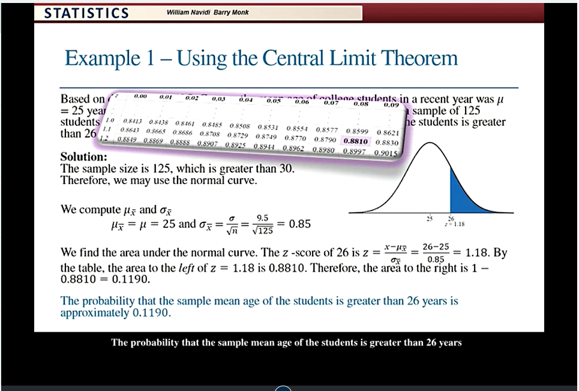
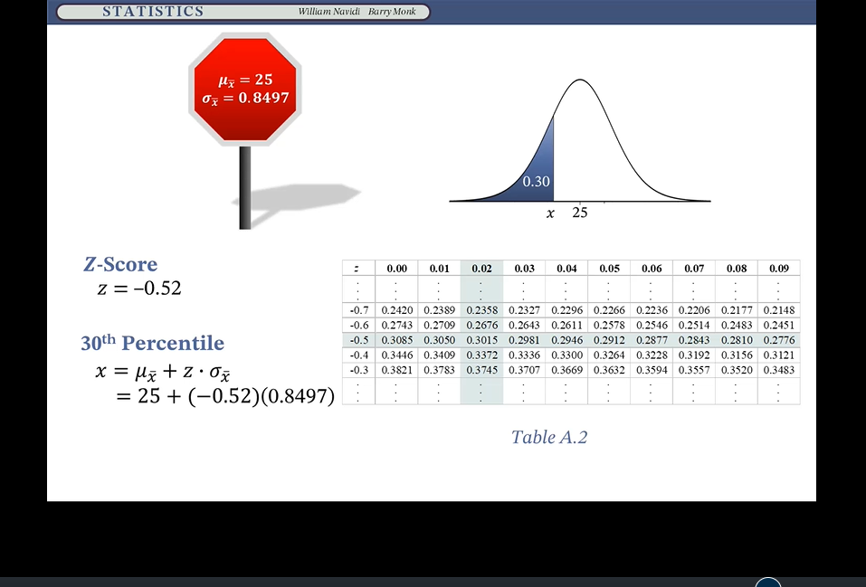
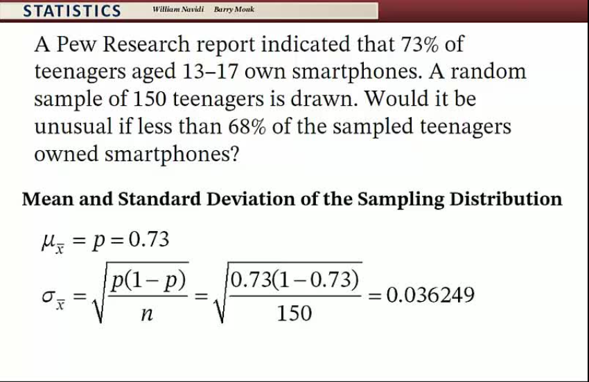
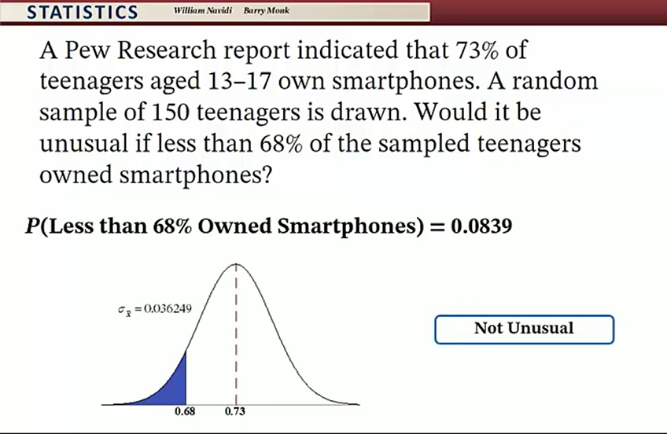

### Sampling Distribution of the Sample Mean and The Central Limit Theorem
    The Central Limit Theorem
    let x-bar be the mean of a large(n>30) simple random sample from a population with mean mu and standard deviation sigma. Then x-bar has an approximately normal distribution. with mean mu-sub x-bar eaqual mu , the mean of the population and standard deviation sigma-sub x-bar equal sigma over the square root of n. 

### Determing when the central limit theorem to use. 
    1. If the population itself is normal, the sample mean x-bar will be normal for any sample size. 
    2. 

###  Using the Central Limit Theorem
    1. 

### Use the Central Limit Theorem to Find a Percentile (Tables and Technology)
    1. 

### Central Limit Theorem for Proportions
    1.  sigma-sub x-bar equals to [square root p*(1-p)/n]

#  Z   Z test大于critical value 拒绝

### Central limit theorem: sample proportion
    
    
