invT(area to the left, degrees of freedom) 

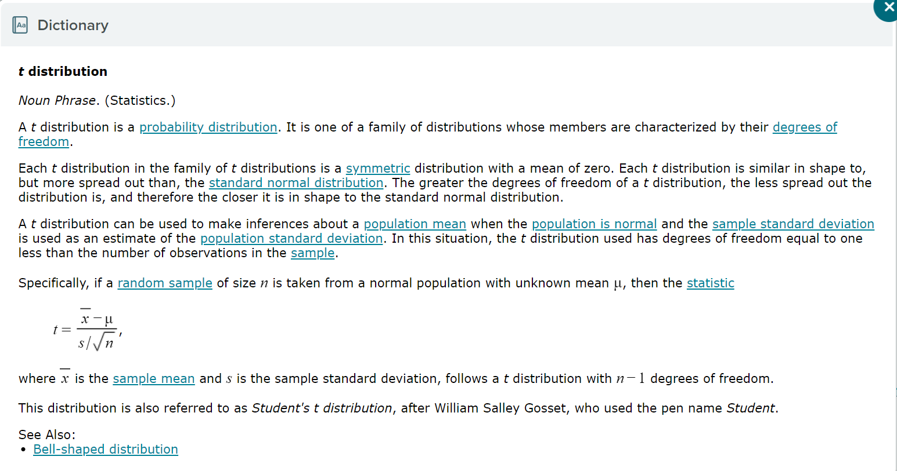

null hypothesis:
    H0

the alternate hypothesis states that the parameter differs from the value specified by the null hypothesis, miu0. the alternated hypothesis is denoted H1, 

    three possible alternate hypotheses.

    1. left-tailed: States that the parameter is less than the value specified by the null hypothesis, for example, H1: miu < miu0

    2. right-tailed: States that the parameter is greater than the value specified by the null hypothesis, for example, H1: miu > miu 0

    3. Two-tailed: States that the parameter is not equal to the value specified by the null hypothesis, for example, H1: miu not equal miu0

A hypothesis Test is Like a Trial 
The purpose of a hypothesis test is to determine how likely it is that the null hypothesis is true

the idea behind a hypothesis test is similar to a criminal trial. At the beginning of a trial, the defendant is assumed to be innocent. Then the evidence is presented. If the evidence strongly indicates that the defendant is guilty, we abandon the assumption of innocence and conclude the defendant is guilty. 

process:

    1. Assume the Null Hypothesis is True
    2. Look at Evidence
    3. Decide Whether to Reject the Null Hypothesis

3. Decide which type of parameter is to be estimated and whether it is appropriate construct the confidence interval.

    1. 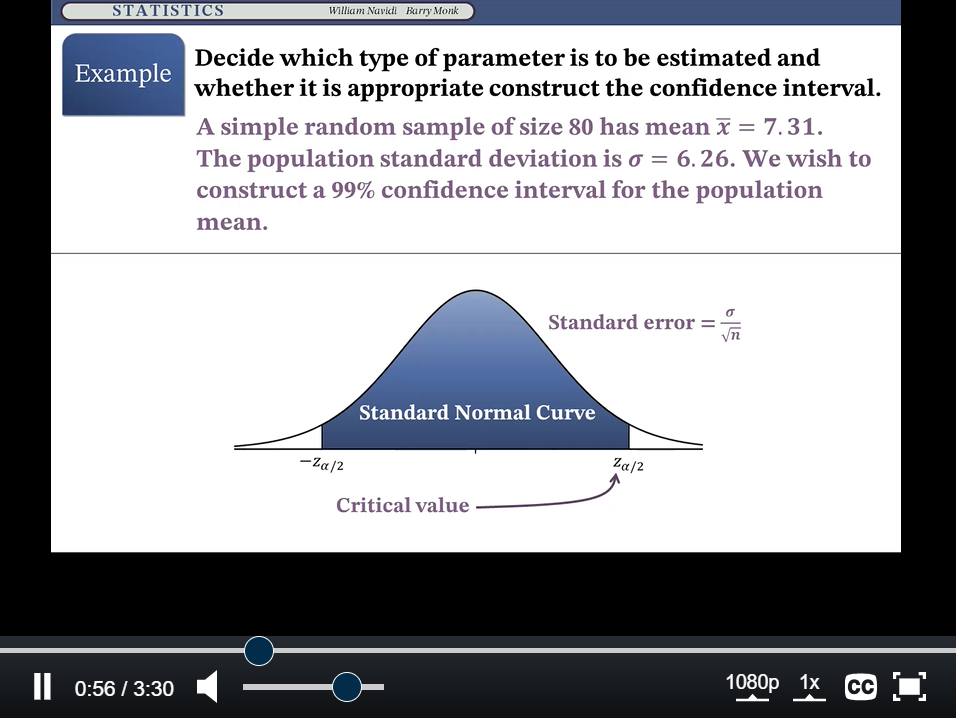
    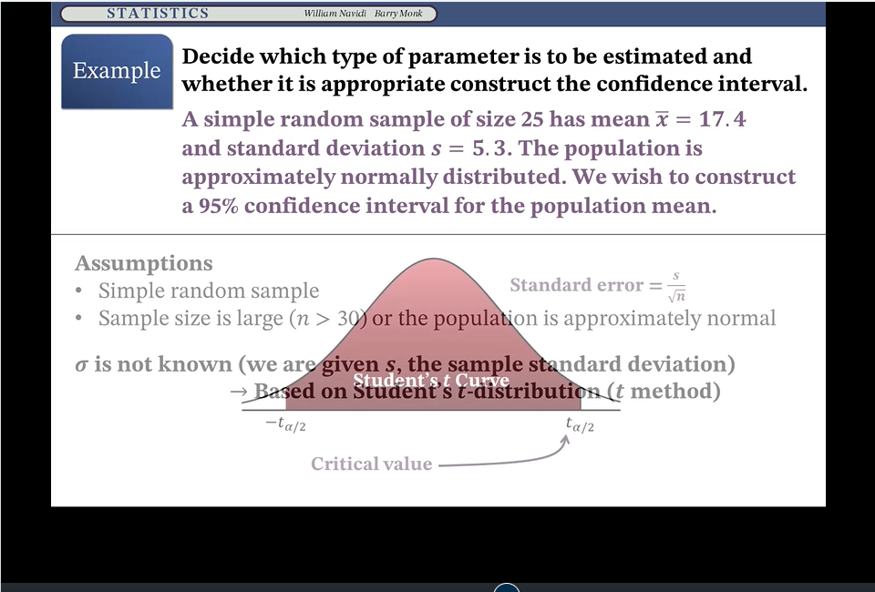

    Assumptions:
    * Simple random sample
    * The population is at least 20 times as large as the sample.
    * The individuals in the population are divided into two categories.
    * The sample contains at least 10 individuals in each category. 

    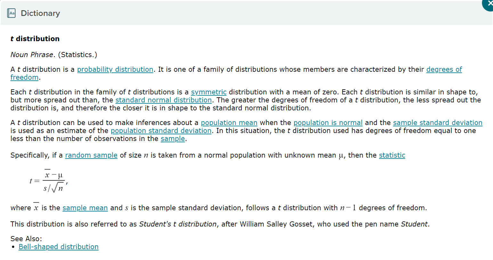
    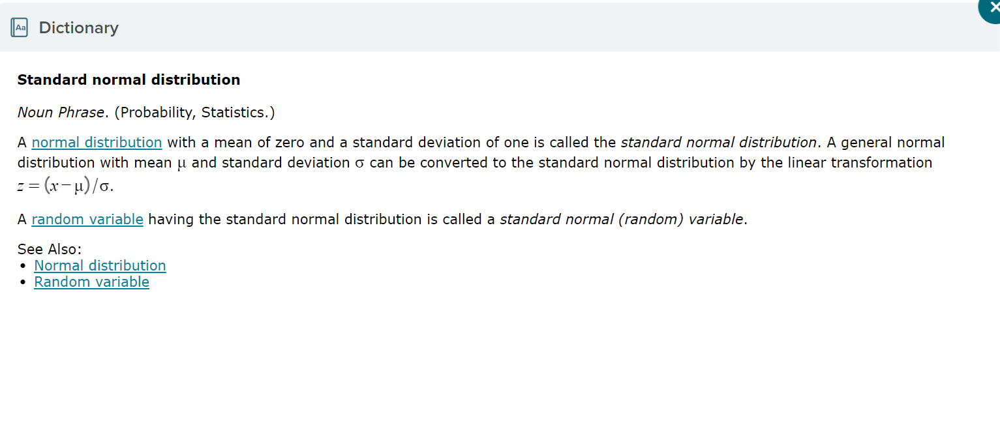

    Suppose that the population is known to be normal or approximately normal.

        If sigma is known, then we use Z for the sampling distribution.
        If sigma is unknown, then we use t for the sampling distribution.

            Note: When we do not know sigma but the sample size is large (>=30) , then we can use Z as a good approximation for t. So, in this case it is also acceptable to use Z for the sampling distribution.

        Suppose that the population is known to be non-normal or we know very little about the population distribution.

If the sample size is large >=30  and  sigma is known, then we use Z for the sampling distribution.
If the sample size is large >=30 and sigma is unknown, then we can use either Z or t for the sampling distribution. (We can use Z because for large samples it is a good approximation of .)
If the sample size is small , whether  is known or unknown, it is unclear what distribution we should use unless we get more information about the population.

### import to know 
    not-normal
              size is large   size is small

    sigma 0       Z/t                need more                
 
    sigma 1       Z                  need more

    normal
                 size is large   size is small

    sigma 0       Z/t                t               
 
    sigma 1       Z                  z

### Constructing a Confidence Interval for a Population Mean with Standard Deviation known, Application 
    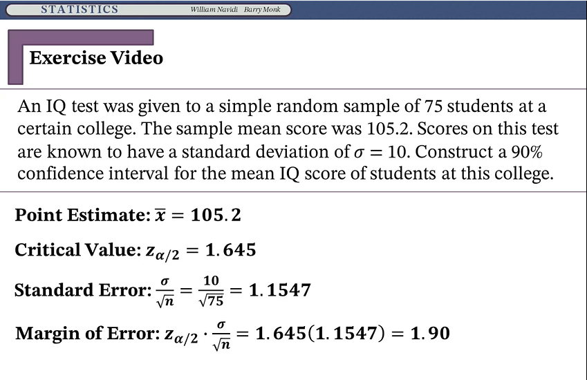 
    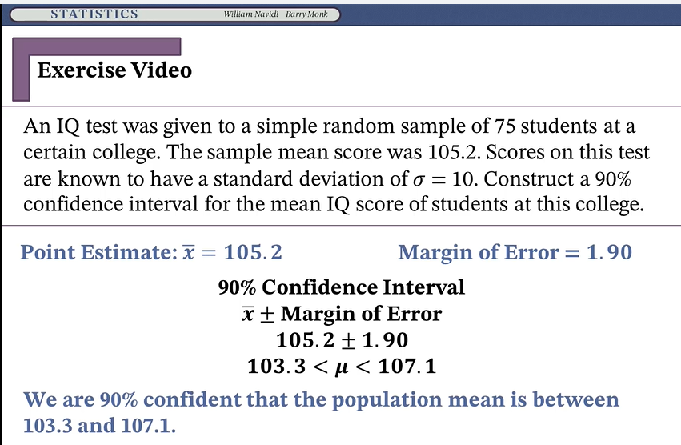

### Finding P-Values
    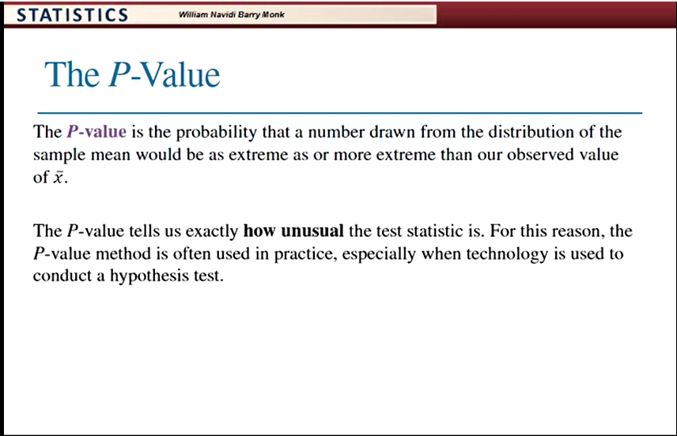
    ** The smaller the P-value , the Stronger the evidence against H0**
    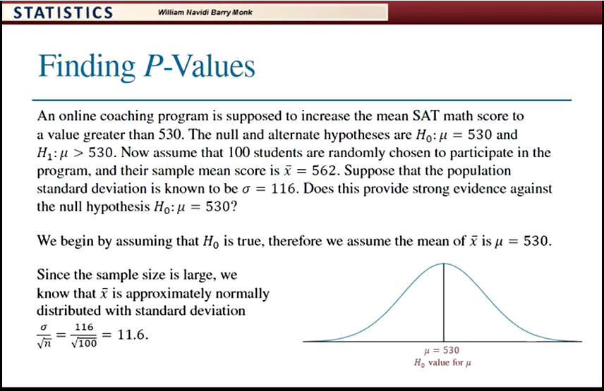
    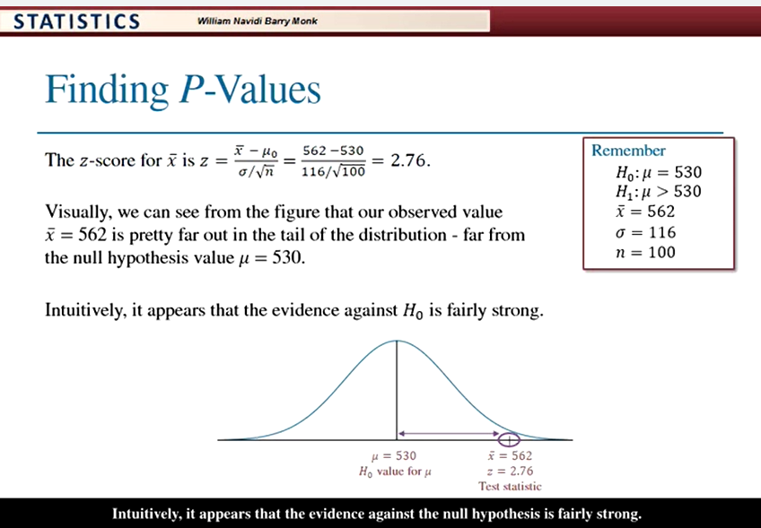
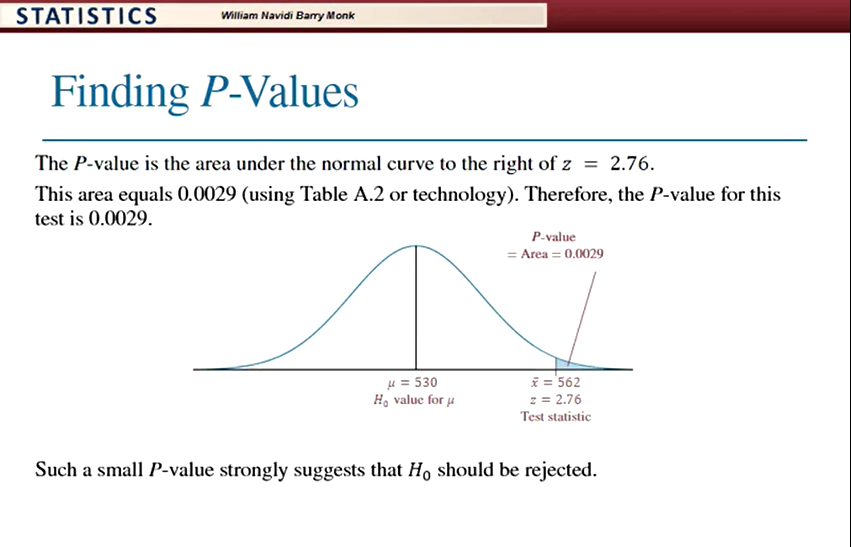
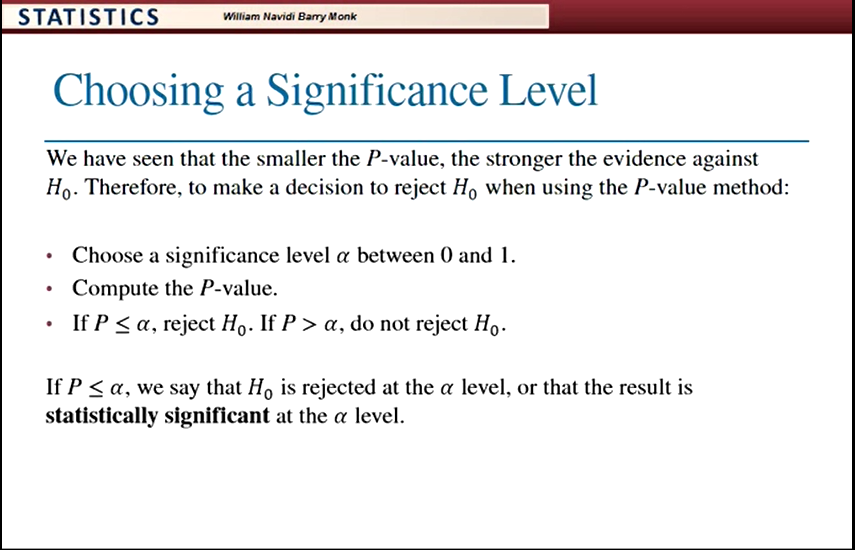

### conculsion
    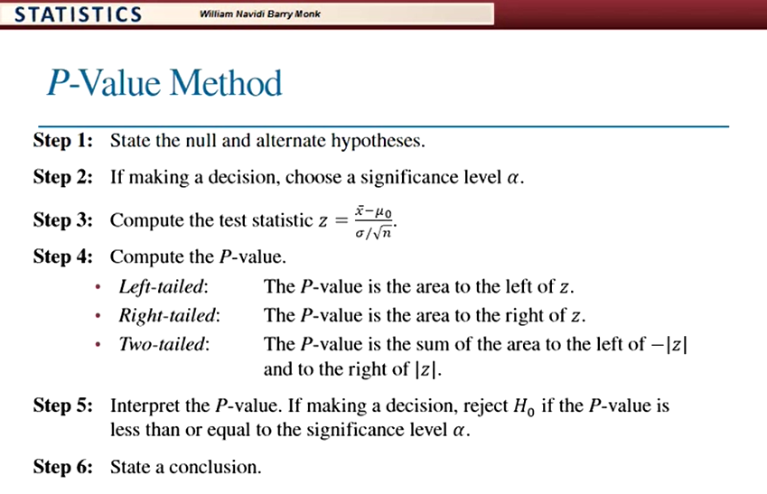