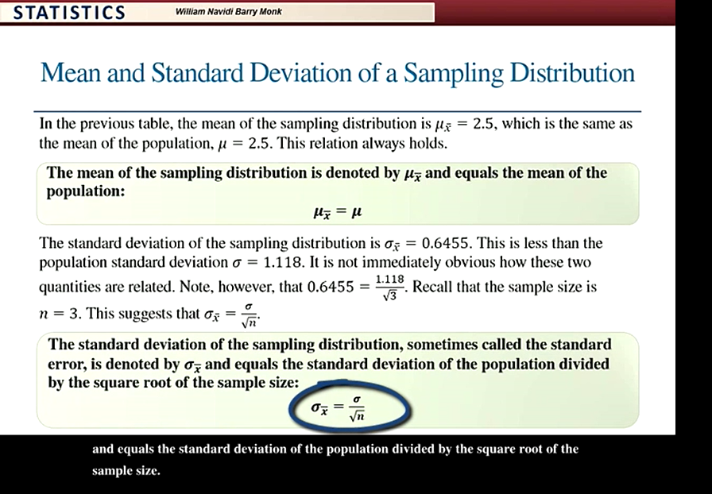

The Central Limit Theorem 
    - 

Sampling Distribution of the Sample Mean

1. The mean of sampling distribution is denoted by uxbar and equals the mean of the population: 

    uxbar = u

2. The standard deviation of the sampling distribution, sometimes called the standard error, is denoted by sigma-sub x-bar and equals the standard deviation of the population divided by the squared root of the sample size:   
    sigma-sub x-bar  : the standard deviation of the sampling distribution is equal to sigma.
                        the standard deviation of the population over the square root of n.

                        

3. the probability histogram for the sampling distribution of x-bar with sample size 3 is obtained from the sampling distribution in the previous table.

    the sample mean is approximately normally distributed even for a small sample size like n=3. 