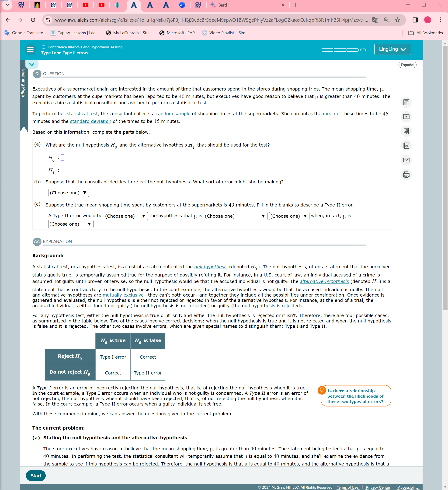
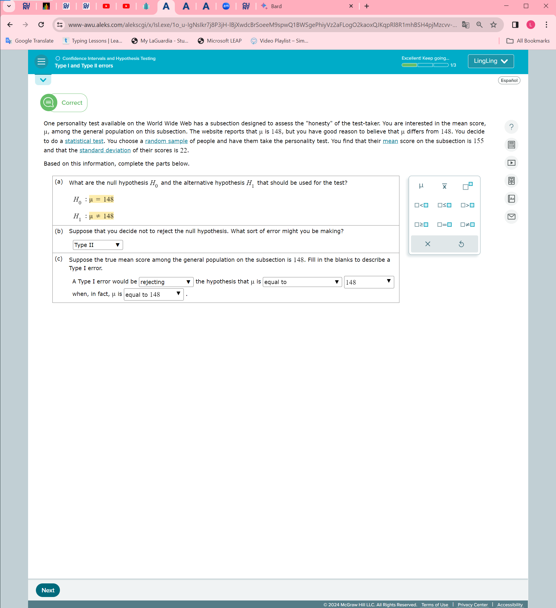
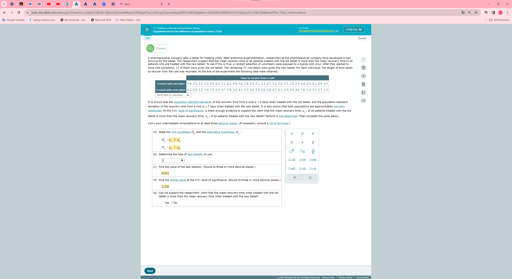
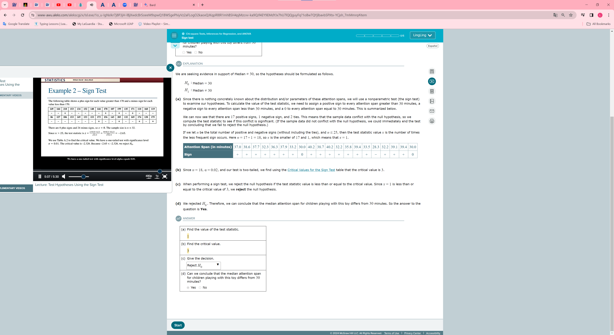
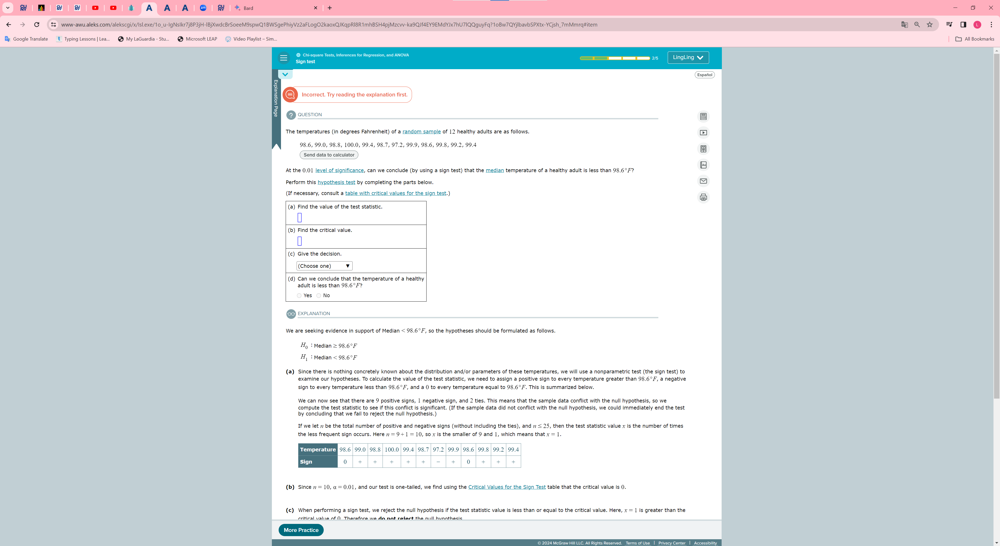

### Confidence Interval for the Mean Difference
    1. d bar is the sample mean of the differences between the values in the matched pairs.
    2. sd is the sample standard deviation of the differences between the values in the matched pairs.
    3. mu d is the population mean difference for the matched pairs

  

  t 2.2009851525
  d 25.75
  s 82.587832034

  
    
    d + t*s/root(n)

### Confidence Interval for the population mean: Use of the 5 distribution
    x-bar : \neg;[0.35363636364]
    t:2.1199052957

### Determing whether two samples are independent or paired and the test
1. Independence
    
    
    
2. paired match
    
    
    

    

### Type I and Type II errors
    
    

    
    

    

### introduction to hypothesis tests for a population proportion using the p

### Hypothesis test for the difference of population means: Paired

### Chi-square test of independence

    E = row total * column total / Grand total

    if chi-square is greater than or equal to the critical value , reject H0. Otherwise do not reject H0

    p-value  smaller than level of significace , reject H0, Otherwise do not reject H0
    

    chi-square test of independence

### Hypothesis test for the difference of population means: Z test

### Chi-square goodness-of-fit test

    practice:
    
    
    

### The Sign Test

 Critical Values for the Sign Test 
 When performing a sign test, we reject the null hypothesis if the test statistic value is less than or equal to the critical value. Since  is less than or equal to the critical value of , we reject the null hypothesis.

schi-quare , smaller

error

### The Signed-Rank Test

When performing a Wilcoxon signed-ranks test, we reject the null hypothesis if the test statistic value is less than or equal to the critical value

### Hypothesis test for the difference of population means: t test for populations with equal variances

### Confidence interval for the difference in Population means: Paired:

### Simple linear regression: Explained and unexplained variation

