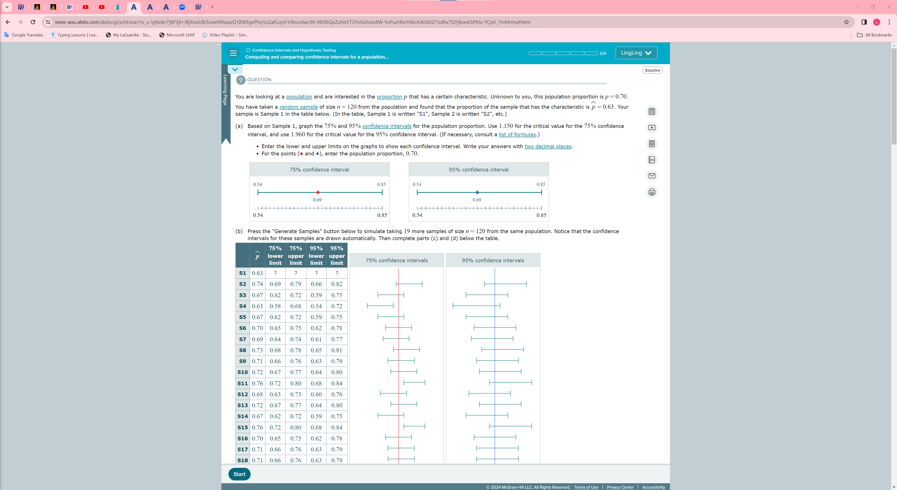
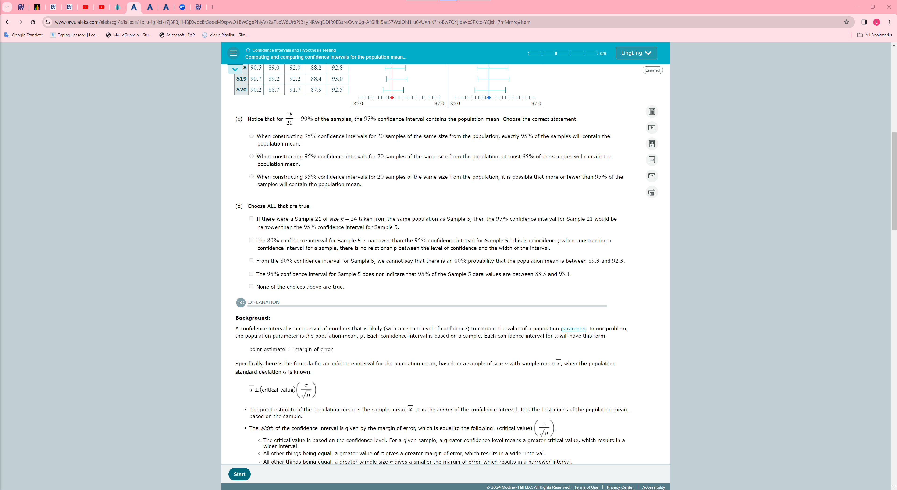
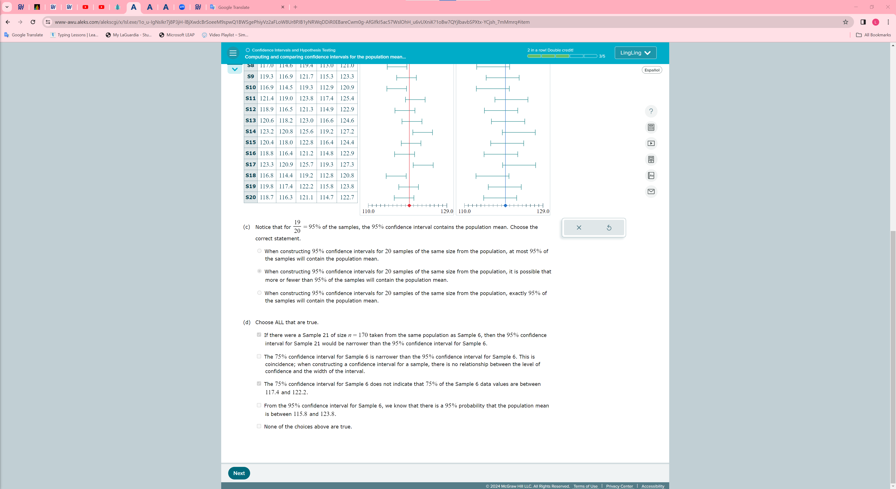

### 1

### 2

### 3 Comparing confidence intervals for the population mean when the population standard deviation is known

### 4 Computing and comparing confidence intervals for a population..
    
    
    
    
    
    

### 5 computing and comparing confidence intervals for a population
    
    
    
    
    

### practice 2 
    
    
    

### practice 3
    
    

## Introduction to confidence intervals for the mean (standard deviation known)
    
    
    
### example:    
    
    
    
    
    
    

### practice 1:
    
    
    
    

### practice 2:
    
    

### practice 3:
    
    

### practice 4:
    
    

### t distribution:
    
   

### Confidence interval for a population proportion
    
    

### Choosing an appropriate sample size
    
    
     answer 151

### Confidence interval for the population mean: Use of t distribution
    
    